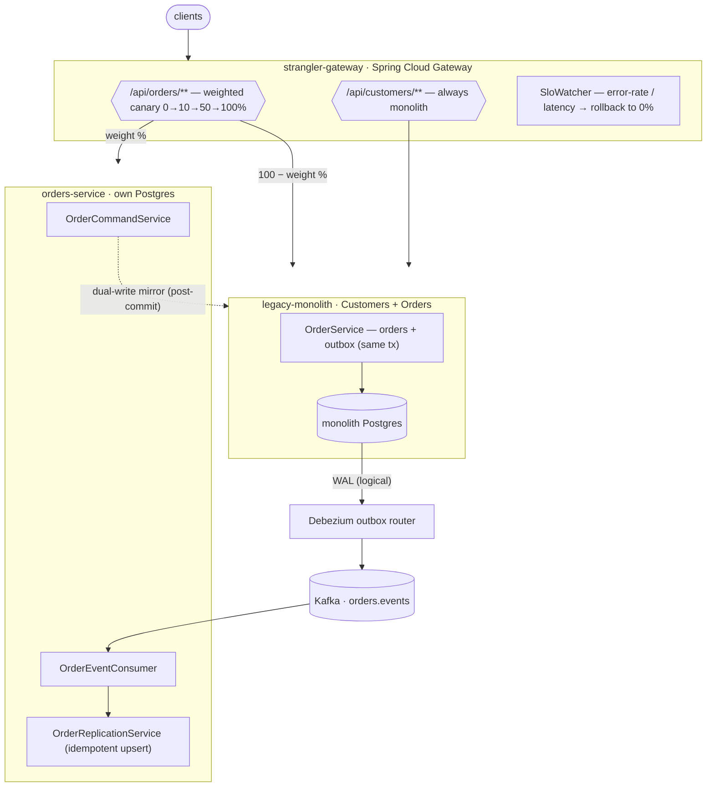
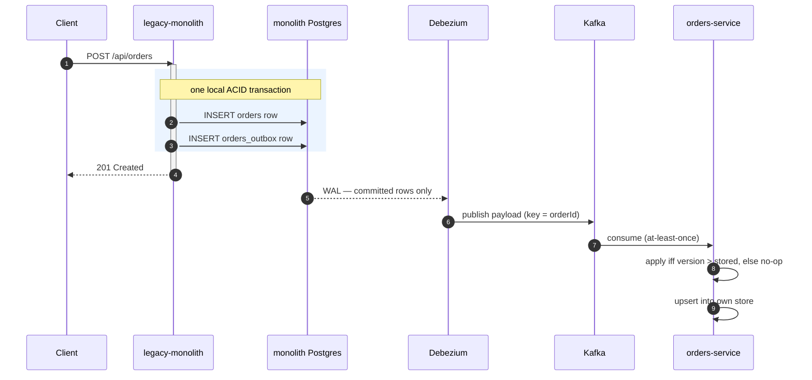
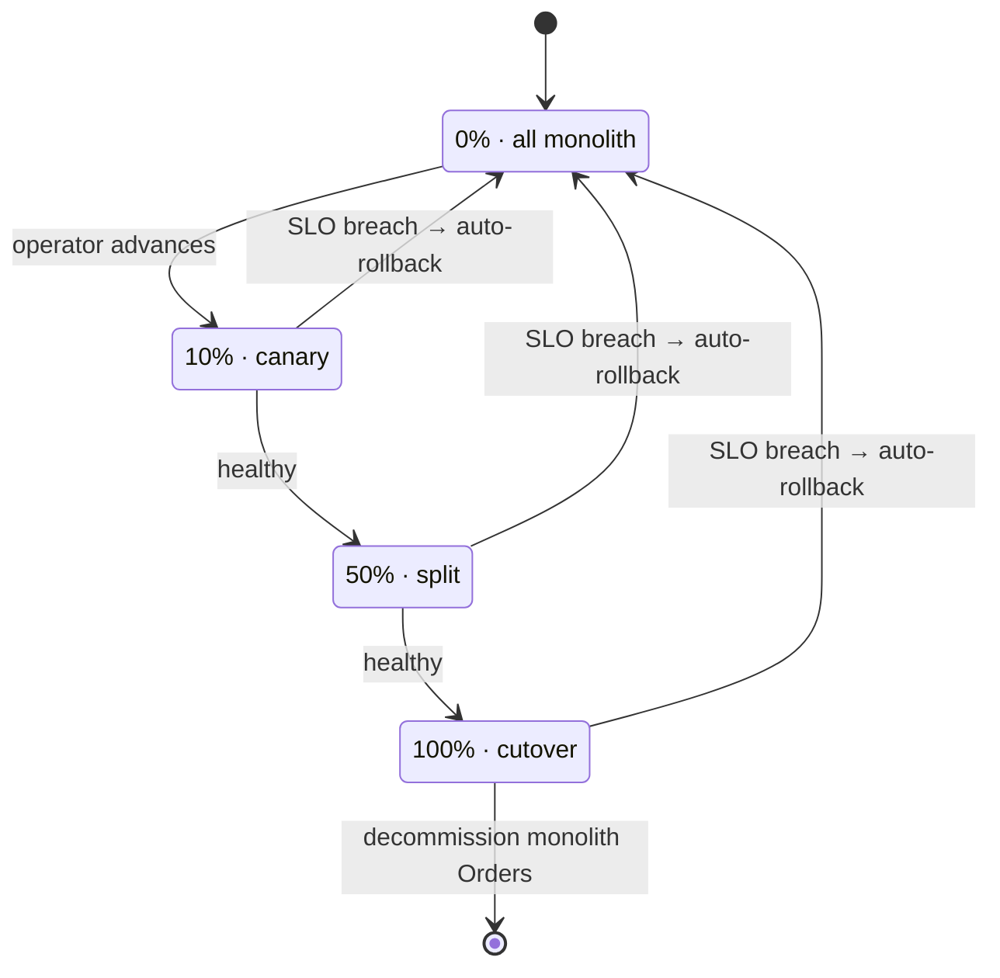

# Zero-Downtime Monolith → Microservices Migration (Strangler-Fig)

Extract a bounded context out of a **live** commerce monolith with no downtime — using a transactional outbox, Debezium CDC, weighted canary routing, and contract tests to keep both sides consistent the whole way.

[](https://github.com/koutilyaY/monolith-to-microservices-migration/actions/workflows/ci.yml)


> **Why this exists.** Greenfield microservices are easy; the hard, real-world problem is carving a
> service out of a system that is already in production and cannot go down. This repo is a small but
> complete, runnable model of that surgery — the Orders context is strangled out of a Customers+Orders
> monolith while the system keeps serving traffic, with every consistency and rollback edge case
> handled in real code, not slideware.

## At a glance

| | |
|---|---|
| **Pattern** | Strangler-fig — *partial* strangle (Orders extracted, Customers deliberately left in the monolith to show the seam) |
| **Write replication** | Transactional outbox → Debezium CDC (Postgres WAL → Kafka), not app-level dual-writes |
| **Reverse path** | Post-commit, best-effort dual-write *mirror* (new service → monolith) during the canary write phase |
| **Consistency model** | Eventual during the dual-run, bounded by CDC lag; strong within each store |
| **Idempotency / ordering key** | Monotonic `aggregateVersion` per order — apply an event **iff** its version is strictly newer |
| **Rollback** | Canary weight in an `AtomicInteger`, read per-request; set to `0` for instant rollback, no redeploy |
| **Auto-rollback** | In-process `SloWatcher` flips weight to 0 on error-rate / latency SLO breach |
| **Green offline** | Outbox tx, idempotent replication, canary + SLO logic, and producer **and** consumer contracts all test on H2 + mocks — no Docker, no network |

## Architecture



<details>
<summary><b>Write path during the dual-run (sequence)</b></summary>


</details>

<details>
<summary><b>Canary weight lifecycle</b></summary>


</details>

## Quickstart (60 seconds, offline)

No Docker, no infra — H2 and mocks back the default suite.

```bash
mvn -q -DskipITs test        # 28 tests: outbox, idempotent replication, canary/SLO, contracts
mvn -q -DskipTests package   # three runnable jars + the contract stubs jar
```

<details>
<summary><b>Run the full stack (docker-compose) and drive the canary</b></summary>

Brings up Postgres ×2 (`wal_level=logical`), Kafka (KRaft, single node), Kafka Connect + Debezium,
and the three apps.

```bash
mvn -DskipTests package
cd infra && docker compose up --build

# register the Debezium outbox connector
curl -s -X POST -H "Content-Type: application/json" \
  --data @debezium/orders-outbox-connector.json http://localhost:8083/connectors
```

Move traffic onto the extracted service and watch it route (ports: gateway 8080, monolith 8081,
orders-service 8082):

```bash
curl localhost:8080/admin/canary                 # current weight + rollback state
curl -XPOST localhost:8080/admin/canary/weight/10
curl -XPOST localhost:8080/admin/canary/weight/50
curl -XPOST localhost:8080/admin/canary/weight/100
curl -XPOST localhost:8080/admin/canary/rollback # instant: all Orders traffic back to monolith
```

Integration tests against real Postgres + Kafka (Testcontainers, needs Docker):

```bash
mvn -Pit verify   # *IT tests: outbox on real Postgres, end-to-end CDC replication
```
</details>

## The strangler-fig playbook

1. **Front everything with a gateway** — any path's backend can change without clients noticing.
2. **Replicate writes with outbox + CDC** — the monolith writes the change and its event in one tx.
3. **Build the new service on the replicated data** — it converges without a shared database.
4. **Shadow / dark-launch reads and compare** — quantify divergence before trusting the new path.
5. **Canary the writes with weighted routing** — 0→10→50→100%, auto-rollback on SLO breach.
6. **Backfill, cut over, decommission** — replay history, reach 100%, delete Orders from the monolith.

<details>
<summary><b>Step details</b></summary>

1. `strangler-gateway` fronts all traffic; initially 100% → monolith.
2. The monolith writes an `orders_outbox` row in the same transaction as every order change
   ([`OrderService`](legacy-monolith/src/main/java/com/koutilya/monolith/service/OrderService.java)).
   Debezium ships those rows to Kafka
   ([connector](infra/debezium/orders-outbox-connector.json)). No application code publishes events.
3. `orders-service` consumes `orders.events` and idempotently upserts into its own store
   ([`OrderReplicationService`](orders-service/src/main/java/com/koutilya/orders/service/OrderReplicationService.java)).
4. Mirror read traffic to the new service and diff responses (documented; no customer impact).
5. Shift `/api/orders/**` toward the new service
   ([`CanaryController`](strangler-gateway/src/main/java/com/koutilya/gateway/canary/CanaryController.java));
   during this phase the new service dual-writes back to the monolith, and
   [`SloWatcher`](strangler-gateway/src/main/java/com/koutilya/gateway/canary/SloWatcher.java)
   auto-rolls-back on a breach.
6. Backfill history ([`backfill.sql`](infra/backfill.sql) /
   [`OrdersBackfillRunner`](legacy-monolith/src/main/java/com/koutilya/monolith/backfill/OrdersBackfillRunner.java)),
   reach 100%, stop dual-write, delete the Orders code + tables from the monolith. Customers stays.
</details>

## Modules / where to look first

| Module | What it is | Look here first |
|---|---|---|
| [`legacy-monolith`](legacy-monolith) | The system being strangled. Customers + Orders in one schema; transactional outbox. | [`service/OrderService.java`](legacy-monolith/src/main/java/com/koutilya/monolith/service/OrderService.java) — same-tx outbox write |
| [`orders-service`](orders-service) | The extracted Orders service. Own store, CDC consumer, dual-write. **Contract producer.** | [`service/OrderReplicationService.java`](orders-service/src/main/java/com/koutilya/orders/service/OrderReplicationService.java) — idempotent upsert |
| [`strangler-gateway`](strangler-gateway) | Spring Cloud Gateway. Weighted canary routing, instant + SLO auto-rollback. | [`canary/CanaryRoutingConfig.java`](strangler-gateway/src/main/java/com/koutilya/gateway/canary/CanaryRoutingConfig.java), [`canary/SloWatcher.java`](strangler-gateway/src/main/java/com/koutilya/gateway/canary/SloWatcher.java) |
| [`infra`](infra) | docker-compose, the Debezium connector, the SQL backfill. | [`debezium/orders-outbox-connector.json`](infra/debezium/orders-outbox-connector.json) |
| [`loadtest`](loadtest) | k6 script for the p99 story. | [`orders.js`](loadtest/orders.js) |

## Contract testing

`orders-service` is the **producer**. The Orders API contract lives in
[`orders-service/src/test/resources/contracts/orders/`](orders-service/src/test/resources/contracts/orders).
`spring-cloud-contract-maven-plugin` generates producer verification tests during `mvn test` that run
the real controller over MockMvc
([`ContractVerifierBase`](orders-service/src/test/java/com/koutilya/orders/contract/ContractVerifierBase.java))
and produces a stub jar. The **consumer** test in the gateway
([`OrdersConsumerContractTest`](strangler-gateway/src/test/java/com/koutilya/gateway/contract/OrdersConsumerContractTest.java))
stands up a WireMock `orders-service` in that same contract shape and asserts the gateway routes to it
and receives the expected body. Both directions run in the default offline build, so a contract break
fails `mvn test`.

## Benchmarks

| Scenario | Command | What it measures | Result |
|---|---|---|---|
| Offline test suite | `mvn -DskipITs test` | 28 tests across 3 modules | passing (see CI) |
| Read latency under load | `k6 run loadtest/orders.js` | p99 of `GET /api/orders` at 50 VUs, tagged by backend | test gate: **p99 < 250 ms** — reproduce on your hardware |

> **Honesty note.** The k6 script is the *basis* for a p99 story, not a published result. Any numbers
> you get are local load-test figures on dev hardware, not production SLOs, and the extracted
> service's advantage (a single-purpose store free of the monolith's unrelated load) is exactly the
> kind of thing that must be re-measured in your own environment. The repo ships the harness and the
> assertion gate; it does not ship invented production numbers.

## Design decisions & tradeoffs

<details>
<summary><b>Why a transactional outbox instead of 2PC/XA?</b></summary>

A distributed transaction spanning the DB and the broker (XA) couples their availability, scales
badly, and is poorly supported across modern brokers. The outbox needs only a *local* ACID
transaction: the business row and the "it changed" row commit together or not at all. The event is
then delivered asynchronously by CDC. We trade immediate delivery for a hard atomicity guarantee plus
at-least-once delivery — the right trade for this problem.
</details>

<details>
<summary><b>Why CDC instead of naive app-level dual-writes?</b></summary>

"Write to the DB, then publish to Kafka" from application code has a dual-write problem: the process
can crash between the two, leaving the DB and the stream inconsistent, with no transaction spanning
them. Outbox + CDC removes the second write from the app entirely — Debezium derives events from the
*already-committed* WAL, so an event exists **iff** the data change committed.
</details>

<details>
<summary><b>Dual-write consistency, idempotency, and the partial-failure failure mode</b></summary>

During the canary write phase the new service is authoritative for writes routed to it. It commits
locally first, then — *after commit*, via `@TransactionalEventListener(AFTER_COMMIT)`
([`OrderMirrorListener`](orders-service/src/main/java/com/koutilya/orders/service/OrderMirrorListener.java))
— best-effort mirrors to the monolith. Two writes are never attempted inside one distributed
transaction. **Failure mode:** if the local commit succeeds but the mirror fails, the authoritative
side is still correct and the customer's request still succeeds; the monolith is briefly stale and is
reconciled by a periodic job (and, symmetrically, the monolith's `mirrorUpsert` is idempotent by
version, so retries are safe). We never hold a DB connection open across the network call, and we
never let a mirror failure roll back a customer order.
</details>

<details>
<summary><b>Consistency during the dual-run</b></summary>

Reads are served from whichever backend the gateway routes to. Both backends converge because
(a) monolith→service replication is driven by the committed WAL and (b) service→monolith mirroring is
idempotent by version. The divergence window is bounded by CDC lag (typically ms–single-digit
seconds) — deliberate eventual consistency, chosen over a shared DB that would keep the two services
coupled. Shadow reads (step 4) quantify that window before we trust the new path.
</details>

<details>
<summary><b>Idempotency + ordering key</b></summary>

Every order carries a monotonically increasing `aggregateVersion`. Consumers apply an event **only if
its version is strictly greater** than what they already store
([`OrderReplicationService.apply`](orders-service/src/main/java/com/koutilya/orders/service/OrderReplicationService.java)).
This single rule makes at-least-once CDC safe against redelivery (equal version → no-op),
out-of-order/stale delivery (lower version → no-op), and genuine updates (higher version → applied).
It also collapses the mirror feedback loop (service → monolith → CDC → service) to a no-op.
</details>

<details>
<summary><b>DB decomposition of a shared schema</b></summary>

The `orders` tables move to a separate physical database owned solely by `orders-service`; Customers
stays in the monolith's schema. Cross-context reads that used to be SQL joins ("orders for a
customer") become an API/`customerId` reference, not a foreign key across services. The order **id
space is shared** (UUID strings) so identities survive the move with no remapping at cutover.
</details>

<details>
<summary><b>How rollback works</b></summary>

The canary weight lives in an `AtomicInteger` read by the gateway route predicate on *every* request,
so setting it to 0 diverts all Orders traffic back to the monolith on the next request — no redeploy,
no restart. `SloWatcher` does this automatically when the new service's error rate or latency breaches
the SLO over an interval.
</details>

## Design FAQ

<details>
<summary><b>One write succeeds and the other fails — what happens?</b></summary>

We never do two writes in one distributed transaction. The authoritative side commits first; the
second write is best-effort *after commit* and idempotent by version on the receiving side. If it
fails, the authoritative side is still correct, the customer request still succeeds, and reconciliation
(plus natural CDC replay) closes the gap. Worst case is bounded staleness on the non-authoritative
side, never lost or corrupted data.
</details>

<details>
<summary><b>Kafka is at-least-once — how is this correct without exactly-once?</b></summary>

We don't need exactly-once *delivery*; we need exactly-once *effect*. The `aggregateVersion` guard
makes application idempotent and order-insensitive: duplicates and stale/out-of-order messages are
no-ops, only strictly-newer versions mutate state. Debezium also preserves per-key order (keyed by
`aggregateid`), so within one order events arrive in order anyway; the guard covers redelivery and
cross-partition edge cases.
</details>

<details>
<summary><b>Won't backfilling historical rows clobber live updates?</b></summary>

No. The backfill re-emits events through the *same* outbox/CDC path, and the consumer upserts by
`(orderId, version)`. A backfilled event carries an *old* version, so if a newer live update has
already been applied, the backfill is a no-op. Backfill and live traffic can run concurrently and
converge to the highest version
([`OrdersBackfillRunner`](legacy-monolith/src/main/java/com/koutilya/monolith/backfill/OrdersBackfillRunner.java)
/ [`backfill.sql`](infra/backfill.sql)).
</details>

<details>
<summary><b>What exactly do the contract tests guard?</b></summary>

The producer (`orders-service`) is verified against the published contract using its real controller
and serialization, so it can't silently change the shape. The consumer (`gateway`) tests against a
stub in that same shape. A breaking change on either side fails `mvn test` before it can reach a
running system.
</details>

<details>
<summary><b>What trips the auto-rollback, and why those signals?</b></summary>

[`BackendMetricsFilter`](strangler-gateway/src/main/java/com/koutilya/gateway/metrics/BackendMetricsFilter.java)
records per-backend latency + outcome into Micrometer. `SloWatcher` computes error rate and mean
latency over the *last interval* (a delta of cumulative counters, so old data doesn't pin the
decision) and rolls back if either breaches its threshold — but only once there are enough requests to
be meaningful (`min-requests`). Error rate catches correctness regressions; latency catches
capacity/perf regressions; the sample-size gate avoids flapping on noise.
</details>

<details>
<summary><b>How do you split a shared schema without breaking joins?</b></summary>

The Orders tables move to their own database; cross-context access that was a SQL join becomes an
explicit reference by `customerId` across an API boundary. The shared UUID id space means no id
remapping at cutover. Consistency between the split stores is maintained by CDC replication
(monolith→service) and idempotent mirroring (service→monolith) during the dual-run, then by making
`orders-service` the sole owner after cutover.
</details>

## Production readiness / non-goals

This is a **teaching-grade, self-contained model of the pattern**, tuned so the default build is green
offline in seconds. The mechanics are real; the operational hardening is intentionally out of scope.
Before running this shape in production you would add:

- **Schema Registry + Avro/Protobuf** for the event payload, instead of ad-hoc JSON, with
  compatibility enforcement.
- **Connector monitoring + a dead-letter topic** — Debezium lag/health alerts and DLQ routing for
  poison messages (the consumer currently logs-and-drops).
- **Outbox retention** — a cleanup job / partition strategy so `orders_outbox` doesn't grow unbounded.
- **Transactional consumer / exactly-once sink** where a downstream side effect isn't naturally
  idempotent (here the version guard makes it so).
- **Prometheus burn-rate SLO alerting** driving rollback, instead of the in-process `SloWatcher` — the
  control loop is identical, the signal source and durability are not.
- **Auth on the `/admin/canary` control plane** — it's open here for demo convenience.
- **Blue-green of the Debezium connector** on schema change, to avoid a decode gap at migration time.

Non-goals: a full commerce domain, production deployment manifests, multi-region, or real SLA numbers.

## Requirements

- **JDK 17+.** Bytecode targets Java 17 (`maven.compiler.release=17`), so the jars run on any JDK 17+.
  Built and tested on **Java 17 and Java 26** — the parent POM bumps Byte Buddy to 1.17.8 and passes
  `-Dnet.bytebuddy.experimental=true` to Surefire so Mockito-based tests (`@WebMvcTest` / `@MockBean`)
  pass on bleeding-edge JDKs too. `mvn test` is green with no `JAVA_HOME` gymnastics.
- **Maven 3.9+.**
- **Docker** only for the full stack and the `-Pit` Testcontainers tests — never for the default build.

## License

[MIT](LICENSE) © 2026 Koutilya Yenumula
